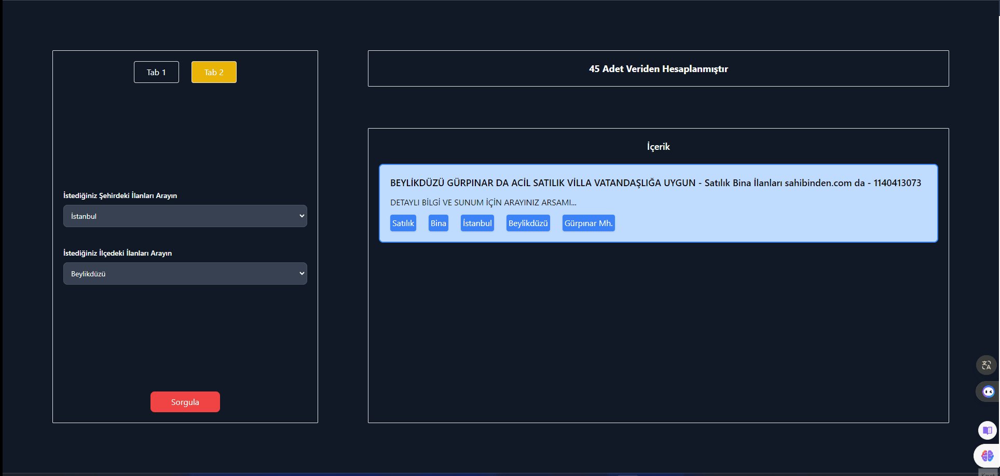

# React + Vite

Emlak İlan Uygulaması
Bu uygulama, çeşitli kriterlere göre filtreleme seçenekleriyle birlikte gayrimenkul özelliklerinin bir listesini görüntüler. Uygulamanın ana özellikleri şunlardır:

Tapu, açıklama, durum, kategori, konum ve parsel numarası gibi ayrıntılı bilgileri içeren mülklerin listesi.
Filtreleme seçenekleri için iki sekme: Özellik durumu (Satılık veya Kiralık) için radyo düğmeleri içeren Tab1 ve konum (il ve ilece) için belirli girişler içeren Tab2.
Filtreleme seçeneklerini göndermek için bir "Sorgula" düğmesi.
Harici bir API'den il ve ilece verilerini alma yeteneği.
Filtreleme olaylarını işlemek ve URL'yi sorgu parametreleriyle güncellemek için Rxjs kullanımı.
Filtreleri görüntülemek için iki yol: sol tarafta filtreli sayfa1 ve sağ tarafta filtreli sayfa2.
Paylaşılan verileri yönetmek ve bileşenlerde yinelemeyi önlemek için Angular hizmetlerinin kullanımı.
Kullanım
Uygulamayı kullanmak için şu adımları izleyin:

Ana sayfaya gidin.
Sekme1'den bir özellik durumu seçin.
Seçmek
Filtreleme seçeneklerini göndermek için "Sorgula" düğmesini tıklayın.
Seçilen filtrelere göre özelliklerin listesini görüntüleyin.

